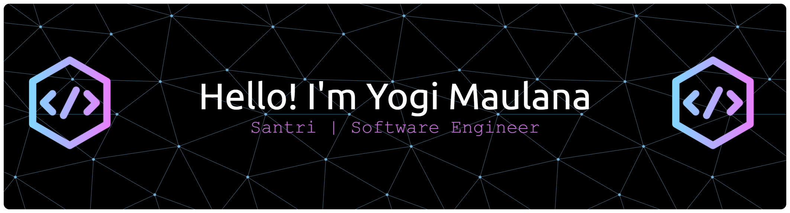

## Hello! I'am Yogi Maulana  👋

 
<!--
**maulanayogi938-lang/bmaulanayogi938-lang** is a ✨ _special_ ✨ repository because its `README.md` (this file) appears on your GitHub profile.

Here are some ideas to get you started:

- 🔭 I’m currently working on ...
- 🌱 I’m currently learning ...
- 👯 I’m looking to collaborate on ...
- 🤔 I’m looking for help with ...
- 💬 Ask me about ...
- 📫 How to reach me: ...
- 😄 Pronouns: ...
- ⚡ Fun fact: ...
-->

- 🌱 I’m currently Studying at Politeknik Negeri Banyuwangi
- 🌱 I’m currently learning [**Laravel**](https://laravel.com) Framework

## 💻 Skills & Tools

  

---

## ✉️ Connect with me

  
  
  
  

<picture>
  <source media="(prefers-color-scheme: dark)" srcset="https://raw.githubusercontent.com/maulanayogi938-lang/maulanayogi938-lang/output/pacman-contribution-graph-dark.svg">
  <source media="(prefers-color-scheme: light)" srcset="https://raw.githubusercontent.com/maulanayogi938-lang/maulanayogi938-lang/output/pacman-contribution-graph.svg">
  
</picture>

###

###

